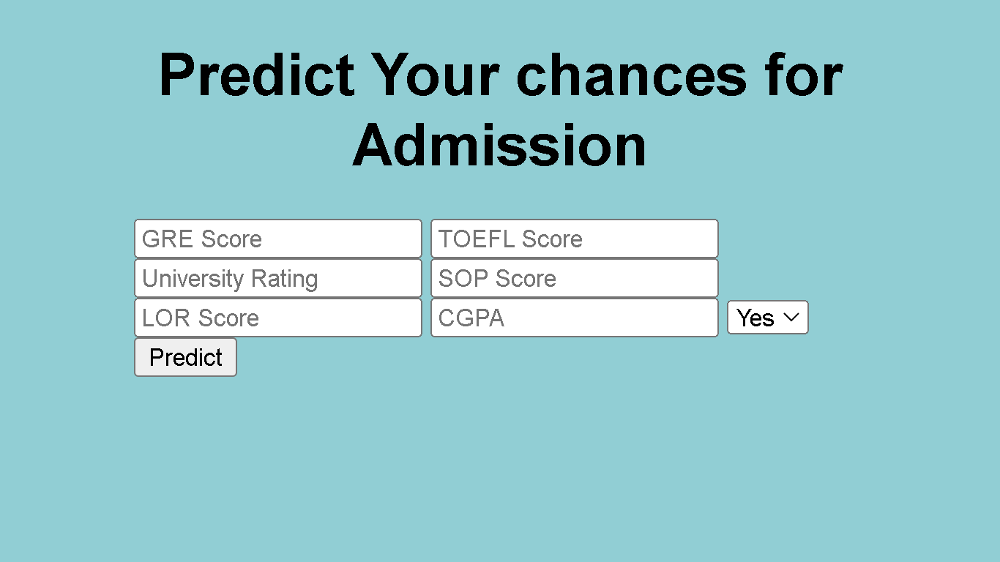
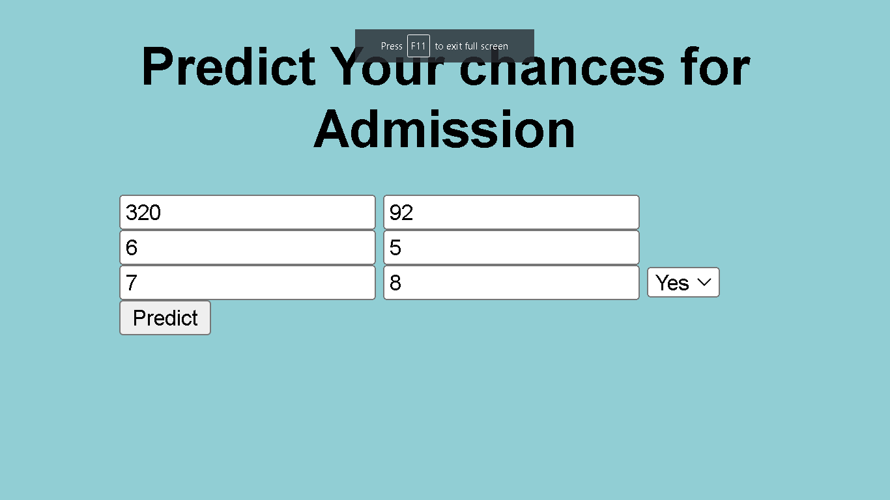
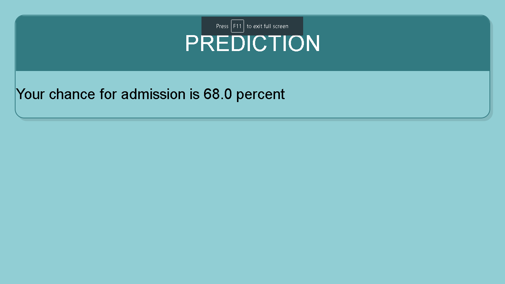

# Study Abroad Predictions
Simple Used Case for predicting chances of admission to foreign universities using linear regression on the basis of GRE score, Target University Rating (out of 10), CGPA(Out of 10), LOR Score(Out of 10), SOP Score(Out of 10), TOEFL Score and whether or not applying for a course that has a research component.

  

  
  

